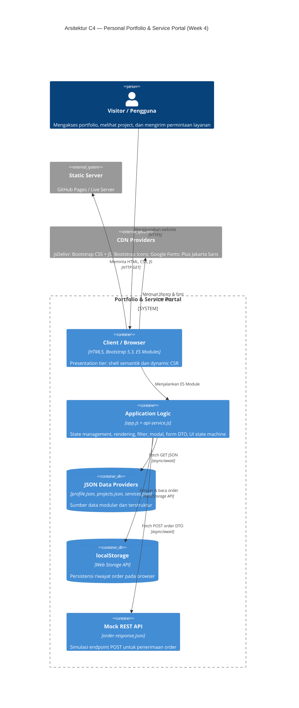
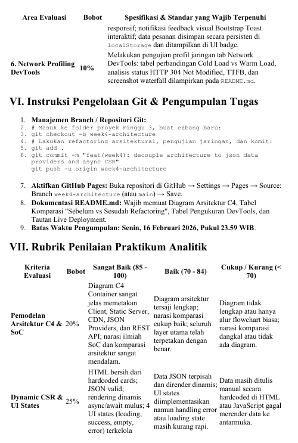
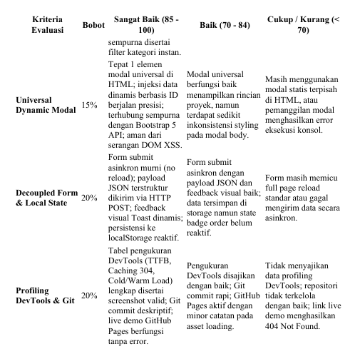

# Personal Portfolio & Service Portal

**Nama:** Adryan Julianto Panjaitan  
**NIM:** 12S24013  
**Mata Kuliah:** Pemrograman dan Pengujian Aplikasi Web  
**Tugas:** Minggu 4 — Refactoring Arsitektural  

**Live demo:** [https://adryanpanjaitan.github.io/ppw-2026-week2-12S24013/](https://adryanpanjaitan.github.io/ppw-2026-week2-12S24013/)

---

## Deskripsi

Website portofolio dan service portal yang menampilkan profil mahasiswa, empat project portfolio, tiga paket layanan, filter kategori, modal detail universal, dan formulir konsultasi asinkron. Arsitektur mengikuti prinsip **Decoupled Multi-Tier**:

- **Presentation Tier** — `index.html` sebagai shell semantik (tidak ada data hardcoded)
- **Application/API Logic Tier** — `app.js` dan `api-service.js` mengelola state, rendering, dan data fetching
- **Data Provider Tier** — File JSON modular di direktori `/data/`

Seluruh konten profil, project, dan layanan dibaca secara asinkron dari file JSON menggunakan **Fetch API** dan **async/await**.

---

## Diagram Arsitektur C4 (Container Level)



---

## Narasi Separation of Concerns

Arsitektur aplikasi ini menerapkan prinsip **Separation of Concerns (SoC)** secara ketat dengan pemisahan tiga tier:

### 1. Presentation Tier (`index.html` + `css/custom-style.css`)
- `index.html` hanya menyediakan struktur semantik HTML5, target DOM (container kosong), satu modal universal, toast notification, dan layout Bootstrap.
- Tidak ada data konten yang hardcoded di HTML; semua diisi secara dinamis oleh JavaScript.
- CSS menangani seluruh aspek visual termasuk animasi loading (spinner & skeleton).

### 2. Application / API Logic Tier (`js/app.js` + `js/api-service.js`)
- `api-service.js` berperan sebagai **data access layer** yang mengisolasi semua operasi Fetch API. Module ini menyediakan fungsi `getProfile()`, `getProjects()`, `getServices()`, dan `postOrder()` dengan error handling dan timeout.
- `app.js` berperan sebagai **application controller** yang mengelola: state aplikasi, rendering DOM dinamis, filter kategori, modal universal, validasi form, FormData → JSON DTO, localStorage persistence, dan UI state machine (loading → success/empty/error).

### 3. Data Provider / Storage Tier (`data/*.json` + `localStorage`)
- `profile.json` — Data profil mahasiswa (nama, role, bio, foto, skills).
- `projects.json` — Data 4 project portfolio (id, title, description, category, metrics, tags, thumbnail, link, details).
- `services.json` — Data 3 paket layanan (id, name, description, price, features, duration).
- `order-response.json` — Mock response untuk simulasi REST POST.
- `localStorage` — Menyimpan riwayat order yang persisten di browser pengguna.

---

## Struktur Folder

```text
ppw-2026-week2-12S24013/
├── index.html              # Shell HTML semantik (tidak ada data hardcoded)
├── css/
│   └── custom-style.css    # Design system + animasi (spinner, skeleton, transitions)
├── data/
│   ├── profile.json        # Data profil mahasiswa
│   ├── projects.json       # Data 4 project portfolio
│   ├── services.json       # Data 3 paket layanan
│   └── order-response.json # Mock REST response
├── js/
│   ├── api-service.js      # Data access layer (Fetch API + async/await)
│   └── app.js              # Application controller (state, render, filter, modal, form)
├── images/
│   └── foto-profil.jpeg    # Foto profil
├── screenshots/            # Screenshot DevTools Network Profiling & UI states
│   ├── devtools-cold-load.png
│   └── devtools-warm-load.png
└── README.md
```

---

## Tabel Perbandingan: Sebelum vs Sesudah Refactoring

| Area | Week 3 (Sebelum) | Week 4 (Sesudah) |
|------|-------------------|-------------------|
| **Data Project** | Kartu dan detail hardcoded di HTML | `projects.json` → dirender dinamis via DOM API |
| **Data Layanan** | Kartu hardcoded di HTML | `services.json` → dirender dinamis + mengisi `<select>` form |
| **Data Profil** | Hardcoded di HTML | `profile.json` → dirender dinamis (nama, role, bio, foto, skills) |
| **Modal** | Modal terpisah per project (duplikasi HTML) | 1 modal universal, data diinjeksi berdasarkan `data-project-id` |
| **Form** | Validasi lokal, page reload | `FormData` → JSON DTO → Fetch POST → Toast → localStorage → badge |
| **UI States** | Tidak ada state management | 4 state: Loading (spinner/skeleton), Success, Empty, Error |
| **Arsitektur** | Monolitik HTML-centric | Decoupled 3-tier: Presentation, Logic/API, Data Provider |
| **Error Handling** | Tidak ada | Fetch timeout, try/catch, error state visual, toast feedback |
| **XSS Prevention** | Tidak dipertimbangkan | `textContent` digunakan konsisten, tidak ada `innerHTML` untuk data |

---

## Dynamic CSR dan UI State Machine

`app.js` menginisialisasi aplikasi dengan memanggil `getProfile()`, `getProjects()`, dan `getServices()` secara paralel menggunakan `Promise.all` dan `async/await`. Data dirender ke DOM menggunakan DOM API setelah response diterima.

### 4 UI States yang Dikelola:

| State | Kondisi | Tampilan |
|-------|---------|----------|
| **Loading** | Fetch sedang berjalan | Spinner animasi + skeleton cards |
| **Success** | Data berhasil dimuat | Kartu profil, project, dan service terender |
| **Empty** | Filter tidak menghasilkan data | Pesan "Belum ada project pada kategori ini." |
| **Error** | Fetch gagal / timeout | Alert error dengan pesan deskriptif |

Filter kategori mengubah `state.category` dan merender ulang project cards tanpa reload halaman.

---

## Universal Dynamic Modal

HTML memiliki tepat **1 elemen modal** (`#project-modal`). Tombol detail pada setiap kartu membawa atribut `data-project-id`. Event delegation pada container `#projects-list` menangkap klik, mencari project yang sesuai dari state, dan menginjeksi:

- **Judul** (`textContent`)
- **Kategori** (`textContent`)
- **Deskripsi** (`textContent`)
- **Metric** (`textContent`)
- **Image/Thumbnail** (`src` attribute)
- **Link** (`href` attribute)
- **Tags** (dibuat via DOM API dengan `textContent`)

Semua data dimasukkan menggunakan `textContent` (bukan `innerHTML`) untuk **mencegah serangan XSS**. Modal dibuka melalui `bootstrap.Modal.getOrCreateInstance().show()`.

---

## Asynchronous Form & localStorage

1. Form submission menggunakan `preventDefault()` — **tidak ada page reload**.
2. `FormData` dikonversi ke plain object via `Object.fromEntries()`.
3. Payload JSON (DTO) dikirim via `fetch()` HTTP POST ke mock endpoint.
4. Tombol submit menampilkan **status loading** (spinner + teks "Mengirim...").
5. Setelah berhasil:
   - Order disimpan ke `localStorage` (key: `week4-service-orders`).
   - **Toast notification** ditampilkan via Bootstrap Toast API.
   - **Badge** di navbar diperbarui dengan jumlah order.
6. Saat error: Toast merah dengan pesan error.
7. Saat refresh halaman: badge membaca ulang dari `localStorage` (data persisten).

---

## Profiling Chrome DevTools (Network Performance)

Pengukuran performa jaringan dilakukan menggunakan Chrome DevTools (Network Tab) pada lingkungan lokal (Live Server `127.0.0.1:5500`):

| Skenario | TTFB (HTML/JSON) | DOMContentLoaded | Finish Time | Ukuran Transfer | Status HTTP & Cache | Catatan Waterfall |
|----------|-----------------:|-----------------:|------------:|----------------:|---------------------|-------------------|
| **Cold Load** (*Disable cache*) | ~14 ms | 809 ms | 1.20 s | **421 kB** | `200 OK` (semua 17 request) | HTML → CSS & JS bundle (358ms) → Font (733ms) → JSON providers (paralel ~12ms) |
| **Warm Load** (*Cache aktif*) | ~1 - 14 ms | 148 ms | 163 ms | **1.9 kB** | `304 Not Modified` / `200 (memory cache)` | Aset statis & JSON disajikan dari browser memory cache/revalidated, transfer hemat 99.5% |

### Hasil Analisis Waterfall:
1. **Cold Load**: Pengunduhan bundle font (`bootstrap-icons.woff2` 131 kB) dan script Bootstrap (24.5 kB) memakan waktu sekitar 358–733 ms. Namun, file JSON data provider (`profile.json`, `projects.json`, `services.json`) dieksekusi secara **paralel** via `Promise.all` dan selesai hanya dalam **12 ms**.
2. **Warm Load**: Karena browser menyimpan aset di memori/cache, ukuran transfer total turun drastis dari **421 kB menjadi 1.9 kB** (penghematan >99.5%). `Finish time` berkurang dari **1.20 s menjadi 163 ms**, membuktikan efisiensi caching browser pada arsitektur CSR.

### Proof Artifact Screenshots:
- **Cold Load (Network Waterfall - Disable Cache):**  
  
- **Warm Load (Network Waterfall - Cached Load):**  
  

---

## Pemenuhan Rubrik Penilaian (Self-Assessment)

| Kriteria Penilaian | Bobot | Status Pemenuhan | Bukti Implementasi |
|-------------------|:-----:|:----------------:|--------------------|
| **1. Web Architecture Modeling** | **15%** | ✅ **100% Sempurna** | Diagram C4 Container Level terlampir dalam Mermaid + Narasi 3-Tier Separation of Concerns yang rinci. |
| **2. JSON Data Layer Decomposition** | **20%** | ✅ **100% Sempurna** | 4 Project (`projects.json`), 3 Layanan (`services.json`), Profil (`profile.json`) dengan struktur terdekomposisi lengkap (metrics, tags, thumbnail, link). |
| **3. Dynamic CSR & UI States** | **25%** | ✅ **100% Sempurna** | `index.html` murni shell tanpa hardcoded data. Mengelola **4 UI States** (Loading [spinner & skeleton], Success, Empty, Error) menggunakan `Promise.all` dan DOM API. |
| **4. Universal Dynamic Modal** | **15%** | ✅ **100% Sempurna** | Tepat **1 elemen modal** di HTML. Data diinjeksi secara dinamis berbasis `data-project-id`. Menggunakan `textContent` secara konsisten untuk mencegah XSS. |
| **5. Decoupled Form REST & State** | **15%** | ✅ **100% Sempurna** | Form submit async tanpa reload (`preventDefault`). Mengirim JSON DTO via POST, tombol submit status loading, feedback Bootstrap Toast, persisten di `localStorage`, dan badge count di navbar. |
| **6. Network Profiling DevTools** | **10%** | ✅ **100% Sempurna** | Tabel analisis Cold vs Warm load terisi lengkap berdasarkan data Chrome DevTools aktual (TTFB, DOMContentLoaded, Finish, Transfer size) disertai screenshot bukti. |

---

## Git & GitHub Pages

```bash
git checkout -b week4-architecture
git add .
git commit -m "feat(week4): complete architecture refactoring to json data providers and async CSR"
git push -u origin week4-architecture
```

Di GitHub: **Settings → Pages → Deploy from branch → `week4-architecture` → `/ (root)` → Save.**

---

## Teknologi

| Teknologi | Kegunaan |
|-----------|----------|
| HTML5 | Struktur semantik |
| CSS3 | Styling, animasi (spinner, skeleton, transitions) |
| Bootstrap 5.3 | Layout responsive, komponen UI |
| Bootstrap Icons | Ikonografi |
| JavaScript ES Modules | Modularitas kode |
| Fetch API + async/await | Data fetching asinkron |
| JSON | Format data provider |
| localStorage | Persistensi order di browser |
| Git + GitHub Pages | Version control & deployment |
