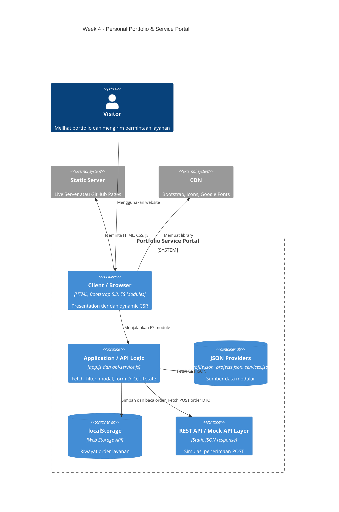

# Personal Portfolio & Service Portal 
**Live demo:** isi setelah GitHub Pages aktif: 'https://adryanpanjaitan.github.io/ppw-2026-week2-12S24013/'

## Deskripsi

Website menampilkan profil mahasiswa, empat project portfolio, tiga paket layanan, filter kategori, modal detail universal, dan formulir konsultasi asynchronous. HTML hanya menjadi shell; konten profil, project, dan layanan dibaca dari file JSON menggunakan Fetch API.

## C4 Container Diagram



## Separation of Concerns

- **Presentation tier:** `index.html` menyediakan struktur semantik, target DOM, form, satu modal universal, toast, dan layout Bootstrap.
- **Application/API logic tier:** `js/app.js` mengatur state, rendering, filter, modal, validasi, FormData, localStorage, dan feedback. `js/api-service.js` menjadi pintu asynchronous Fetch.
- **Data provider/storage tier:** `data/*.json` menyimpan konten modular. `localStorage` menyimpan order pada browser. `order-response.json` menjadi response mock untuk simulasi REST statis.

## Struktur Folder

```text
ppw-2026-week4-[NIM]/
├── index.html
├── css/
│   └── custom-style.css
├── data/
│   ├── profile.json
│   ├── projects.json
│   ├── services.json
│   └── order-response.json
├── js/
│   ├── api-service.js
│   └── app.js
├── images/
│   └── foto-profil.jpeg
├── screenshots/
└── README.md
```

## Perbandingan Week 3 dan Week 4

| Area | Week 3 | Week 4 |
| --- | --- | --- |
| Project | Kartu dan detail hardcoded di HTML | `projects.json` dirender dinamis |
| Layanan | Belum memiliki provider layanan | `services.json` mengisi kartu dan select form |
| Modal | Modal terpisah per project | Satu modal universal berdasarkan `data-project-id` |
| Form | Validasi dan pesan lokal | FormData -> DTO JSON -> Fetch POST -> Toast -> localStorage -> badge |
| Arsitektur | HTML-centric | Presentation, logic/API, data provider terpisah |

## Dynamic CSR dan UI State

`app.js` memanggil `getProfile()`, `getProjects()`, dan `getServices()` dengan `Promise.all`, `fetch()`, serta `async/await`. Kartu dibuat menggunakan DOM API setelah response diterima. Filter kategori mengubah state dan merender ulang tanpa reload.

Empat kondisi UI yang tersedia:

1. **Loading:** pesan `Memuat project...` dan `Memuat layanan...`.
2. **Success:** data berhasil menjadi kartu profile, project, dan service.
3. **Empty:** filter yang tidak menghasilkan data menampilkan pesan empty state.
4. **Error:** kegagalan provider menampilkan feedback error yang jelas.

Jalankan melalui Live Server atau static server karena Fetch tidak dapat diandalkan dari `file://`.

## Universal Dynamic Modal

HTML memiliki tepat satu `#project-modal`. Tombol detail membawa `data-project-id`. Event delegation mencari project yang sesuai, mengisi judul, kategori, deskripsi, metric, dan tags, kemudian membuka modal melalui Bootstrap Modal API. Data dinamis dimasukkan memakai `textContent` untuk mengurangi risiko XSS.

## Asynchronous Form dan localStorage

Submit form memakai `preventDefault()`, `FormData`, `Object.fromEntries()`, dan payload JSON. Tombol submit dinonaktifkan selama request. `api-service.js` menjalankan Fetch POST ke `data/order-response.json` sebagai mock REST layer; fallback memungkinkan simulasi tetap berjalan di static hosting tanpa backend sungguhan. Setelah berhasil, order disimpan di key `week4-service-orders`, toast ditampilkan, dan badge diperbarui. Saat refresh, badge membaca ulang localStorage.

## Pengujian Manual

1. Jalankan Live Server dari root proyek.
2. Pastikan loading berubah menjadi success dan tampil 4 project serta 3 layanan.
3. Klik filter `UI/UX` dan `Development`; uji empty state dengan kategori sementara yang tidak memiliki data.
4. Buka detail project berbeda dan pastikan yang dipakai tetap modal universal.
5. Ubah nama file JSON sementara untuk memeriksa error state, lalu kembalikan namanya.
6. Submit form kosong dan tidak valid; pastikan validasi tampil tanpa reload.
7. Submit data valid; pastikan tombol menjadi `Mengirim...`, toast muncul, badge bertambah, dan data ada di localStorage.
8. Refresh halaman dan pastikan jumlah order tetap ada.
9. Uji desktop/mobile dan pastikan Console tidak berisi error.

## Profiling Chrome DevTools

Angka harus diambil sendiri dari browser, bukan dibuat. Isi tabel berikut dengan hasil aktual.

| Skenario | TTFB | FCP | Cache/status | Waterfall dan catatan |
| --- | ---: | ---: | --- | --- |
| Cold load | ____ ms | ____ ms | `200`, transfer ____ KB | ____ |
| Warm load | ____ ms | ____ ms | `304`/memory cache/actual: ____ | ____ |

Cara pengukuran:

1. Buka DevTools `F12`, tab **Network**, centang **Disable cache**, pilih **Empty cache and hard reload** untuk cold load.
2. Klik request `index.html`, lihat **Timing** untuk TTFB. Catat juga request JSON dan urutan waterfall.
3. Buka tab **Performance**, reload, dan catat marker First Contentful Paint.
4. Untuk warm load, uncheck **Disable cache** lalu reload normal dan bandingkan transfer serta durasi.
5. Untuk `304 Not Modified`, catat hanya bila server aktual mengembalikan status `304`. Jika server lokal memberi status lain, tulis status sebenarnya.

Screenshot yang perlu dikumpulkan:

- Network cold load dengan request HTML, CSS, JS, JSON, dan waterfall.
- Network warm load dengan cache/status aktual.
- Timing `index.html` untuk TTFB.
- Performance timeline untuk FCP.
- UI success, empty, error, modal universal, toast, dan badge localStorage.

## Foto Profil

Foto berada di `images/foto-profil.jpeg`. Path digunakan oleh `#profile-photo` dan nilai `photo` pada `data/profile.json`. Untuk mengganti foto, timpa file tersebut atau ubah nilai `photo` di `profile.json`.

## Git dan GitHub Pages

Jalankan setelah Git tersedia dan remote sudah dikonfigurasi:

```bash
git checkout -b week4-architecture
git add index.html css/custom-style.css data js README.md images
git commit -m "feat(week4): decouple architecture to json data providers and async CSR"
git push -u origin week4-architecture
```

Di GitHub, buka **Settings > Pages**, pilih **Deploy from a branch**, branch `week4-architecture`, folder `/ (root)`, lalu simpan. Setelah URL aktif, masukkan URL aktual pada bagian Live demo.

## Teknologi

HTML5, Bootstrap 5.3, Bootstrap Icons, CSS3, JavaScript ES Modules, Fetch API, async/await, JSON, localStorage, Git, dan GitHub Pages.
